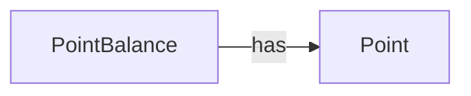

# Django Points API

- Django로 구현하는 Point 적립금 서비스

# Enviorment

## Python Version

- Python 3.11.5

## DataBase

- MySQL 8.0

## Execution Guide

```shell
$ make run.db
$ make run.local
```

# Data Model

## Point

- 사용자의 포인트 적립 또는 차감 이력을 나타내는 엔티티
- 각각의 적립금 트랜잭션을 나타냄

## Point Balance

- 사용자의 총 포인트 정보를 담고있는 엔티티

## Relation

### Point & Point Balance



- Point Balance 와 Point 는 1:N 관계


