# TL;DR
- Django + DRF 기반의 포인트 적립/차감 API 서비스입니다. 
- Optimistic Locking으로 동시성을 제어하고, Redis 캐싱으로 성능을 최적화했으며, APScheduler로 일별 리포트를 자동 생성합니다.

**🎯 핵심 기능**

- 포인트 적립/차감 처리 (EARN/USED/CANCELED)
- 실시간 포인트 잔액 조회
- 거래 이력 추적 및 페이징
- 자동화된 일별 통계 리포트

**⚡ 기술적 특징**

- **동시성 제어**: Optimistic Locking + 재시도 메커니즘
- **고성능**: Redis 캐싱 + 페이징 처리
- **확장성**: API 버전 관리 (v1/v2)
- **안정성**: 전역 예외 처리 + 트랜잭션 보장
- **모니터링**: Locust 성능 테스트 통합

**🛠 기술 스택**: Python 3.11, Django 5.2, MySQL 8.0, Redis, APScheduler

---

# Table of Contents

- [프로젝트 개요](#프로젝트-개요)
- [주요 기능](#주요-기능)
- [기술적 특징](#기술적-특징)
    - [동시성 제어](#동시성-제어)
    - [캐싱 시스템](#캐싱-시스템)
    - [배치 처리](#배치-처리)
    - [성능 테스트](#성능-테스트)
- [기술 스택](#기술-스택)
- [프로젝트 구조](#프로젝트-구조)
- [Diagram](#diagram)
    - [Component Diagram](#component-diagram)
    - [Class Diagram](#class-diagram)

# 프로젝트 개요

Django 기반의 사용자 포인트 적립/차감 관리 API 서비스입니다.

## 주요 기능

- **포인트 적립/차감 처리**: 사용자별 포인트 증감 트랜잭션 관리
- **포인트 잔액 관리**: 실시간 포인트 잔액 조회 및 업데이트
- **거래 이력 관리**: 모든 포인트 거래 내역 추적 및 저장
- **일별 리포트 생성**: 자동화된 일별 포인트 사용/적립 통계

# 프로젝트 구조

## 디렉토리 구조

```
src/
├── apps/                           # 메인 애플리케이션
│   ├── batch/                      # 배치 처리 모듈
│   │   ├── point_balance_sync_job_config.py
│   │   └── scheduler.py
│   ├── migrations/                 # 데이터베이스 마이그레이션
│   ├── models/                     # 데이터 모델
│   │   ├── point.py               # 포인트 거래 모델
│   │   ├── point_balance.py       # 포인트 잔액 모델
│   │   ├── point_summary.py       # 포인트 요약 모델
│   │   └── daily_report.py        # 일별 리포트 모델
│   ├── service/                    # 비즈니스 로직 계층
│   │   ├── exceptions/            # 커스텀 예외
│   │   ├── v1/                    # 서비스 V1
│   │   │   └── point_service.py
│   │   └── v2/                    # 서비스 V2
│   │       └── point_service.py
│   ├── views/                      # API 뷰 계층
│   │   ├── schema/                # API 스키마
│   │   │   ├── point_earn_schema.py
│   │   │   ├── point_use_schema.py
│   │   │   ├── point_cancel_schema.py
│   │   │   └── point_search_schema.py
│   │   ├── v1/                    # API V1
│   │   │   └── point_view.py
│   │   └── v2/                    # API V2
│   │       └── point_view.py
│   ├── urls/                       # URL 라우팅
│   │   ├── v1.py                  # V1 URL 설정
│   │   └── v2.py                  # V2 URL 설정
│   ├── tests/                      # 테스트 모듈
│   │   ├── locust/                # 성능 테스트
│   │   │   ├── v1/
│   │   │   │   └── test_point_earn_api.py
│   │   │   └── v2/
│   │   │       └── test_point_earn_api.py
│   │   ├── v1/                    # 단위 테스트 V1
│   │   │   ├── test_point_earn_view.py
│   │   │   └── test_point_cancel_view.py
│   │   └── test_point.py          # 공통 테스트
│   └── scripts/                    # 유틸리티 스크립트
│       └── fake_data_generate.py  # 테스트 데이터 생성
├── config/                         # Django 설정
│   ├── settings/                  # 환경별 설정
│   │   ├── base.py               # 기본 설정
│   │   └── local.py              # 로컬 환경 설정
│   ├── urls.py                   # 메인 URL 설정
│   ├── asgi.py                   # ASGI 설정
│   ├── wsgi.py                   # WSGI 설정
│   └── exception_handler.py      # 전역 예외 처리
├── contrib/                        # 공통 유틸리티
│   └── abstract/                  # 추상 클래스
│       └── model/                # 추상 모델
├── manage.py                      # Django 관리 명령
├── conftest.py                    # pytest 설정
└── uwsgi.ini                      # uWSGI 설정
```

## 아키텍처 특징

- **src-layout 구조**: 체계적인 Django 프로젝트 아키텍처
- **계층화된 설계**: Models → Services → Views의 명확한 계층 분리
- **버전 관리**: API v1, v2를 통한 하위 호환성 유지
- **테스트 환경**: pytest 기반 단위 테스트 + Locust 성능 테스트
- **API 설계**: APIView + LimitOffsetPagination 기반 RESTful API
- **배치 처리**: APScheduler를 활용한 스케줄링 시스템
- **예외 처리**: 전역 예외 핸들러를 통한 일관된 에러 응답

# 기술적 특징

## 동시성 제어

- **Optimistic Locking**: Django ORM 기반 동시 접근 제어
- **재시도 메커니즘**: backoff 라이브러리를 통한 트랜잭션 안정성 보장

## 캐싱 시스템

- **Redis 기반 캐싱**: 고성능 데이터 조회를 위한 인메모리 캐싱
- **RPS 최적화**: 초당 요청 처리량 향상

## 배치 처리

- **APScheduler 통합**: Django와 연동된 스케줄링 시스템
- **자동 리포트**: 일별 포인트 통계 자동 생성

## 성능 테스트

- **Locust 부하 테스트**: API 성능 검증 및 병목 지점 분석
- **동시성 테스트**: 멀티 유저 환경에서의 안정성 검증

### 기술 스택

- **Backend**: Python 3.11, Django 5.2.2, Django REST Framework 3.16.0
- **Database**: MySQL 8.0
- **Cache**: Redis
- **Testing**: pytest-django, Locust
- **Scheduling**: APScheduler

# Diagram

## Component Model

시스템의 전체 아키텍처와 각 컴포넌트 간의 관계를 나타낸 컴포넌트 다이어그램입니다.

```mermaid
C4Component
    title Component Diagram - Django Points API System (Improved Layout)
%% 데이터 저장소
    System_Boundary(storage, "Data Storage") {
        ContainerDb(mysql, "MySQL", "Relational Database", "포인트 거래 내역 및 사용자 데이터")
        ContainerDb(redis, "Redis", "In-Memory Cache", "고성능 캐싱 및 세션 관리")
    }

%% 외부 시스템
    System_Boundary(external, "External Systems") {
        Component(monitoring, "Monitoring", "Performance Testing", "Locust 부하 테스트 및 성능 모니터링")
    }

%% 내부 시스템 경계
    System_Boundary(api, "Django Points API") {
        Component(models, "Models", "Django ORM", "Point, PointBalance, DailyPointReport")
        Component(cache, "Cache Layer", "Django Cache Framework", "포인트 잔액 및 통계 캐싱")
        Component(batch, "Batch Jobs", "APScheduler", "일별 리포트 생성 및 배치 처리")
        Component(services, "Service Layer", "Business Logic", "비즈니스 로직 및 트랜잭션 관리")
        Component(views, "API Views", "Django REST Framework", "포인트 적립/차감, 잔액 조회, 거래 이력 API")
    }

%% 흐름 정리
    Rel(models, mysql, "Reads/Writes", "DB 영속화")
    Rel(cache, redis, "Reads/Writes", "캐시 저장")
    Rel(views, services, "Calls", "비즈니스 로직 위임")
    Rel(services, models, "Uses", "ORM을 통한 DB 액세스")
    Rel(services, cache, "Reads/Writes", "캐시 레이어 접근")
    Rel(batch, services, "Uses", "비즈니스 로직 재사용")
    Rel(batch, models, "Uses", "모델 직접 액세스")
%% 스타일
    UpdateElementStyle(views, $bgColor="#E1F5FE", $fontColor="#01579B")
    UpdateElementStyle(services, $bgColor="#F3E5F5", $fontColor="#4A148C")
    UpdateElementStyle(models, $bgColor="#E8F5E8", $fontColor="#1B5E20")
    UpdateElementStyle(batch, $bgColor="#FFF3E0", $fontColor="#E65100")
    UpdateElementStyle(cache, $bgColor="#FFEBEE", $fontColor="#B71C1C")
    UpdateElementStyle(mysql, $bgColor="#E0F7FA", $fontColor="#006064")
    UpdateElementStyle(redis, $bgColor="#FCE4EC", $fontColor="#880E4F")
    UpdateElementStyle(monitoring, $bgColor="#ECEFF1", $fontColor="#263238")


```



**API Views Layer**

- Django REST Framework 기반의 RESTful API 엔드포인트
- 포인트 적립/차감, 잔액 조회, 거래 이력 조회 기능 제공
- LimitOffsetPagination을 통한 대용량 데이터 페이징 처리

**Service Layer**

- 포인트 처리의 핵심 비즈니스 로직 구현
- Optimistic Locking을 통한 동시성 제어
- backoff 라이브러리를 활용한 재시도 메커니즘
- 트랜잭션 안정성 보장

**Models Layer**

- Django ORM 기반의 데이터 모델
- Point, PointBalance, DailyPointReport 등 핵심 엔티티
- 데이터 무결성 및 관계 관리

**Batch Jobs**

- APScheduler를 활용한 스케줄링 시스템
- 일별 포인트 통계 자동 생성
- 시스템 유지보수 작업 자동화

**Cache Layer**

- Redis 기반 고성능 인메모리 캐싱
- 포인트 잔액 조회 성능 최적화
- RPS(Request Per Second) 향상

**External Systems**

- Locust를 통한 성능 테스트 및 모니터링
- 동시성 테스트 및 병목 지점 분석

## Class Model

- 포인트 시스템의 핵심 모델들 간의 관계를 나타낸 클래스 다이어그램입니다.

```mermaid
classDiagram
    direction TB
%% 상위 추상 클래스
    class TimestampedModel {
        <<abstract>>
        +DateTimeField created_at
        +DateTimeField updated_at
    }

%% 주요 도메인 모델
    class Point {
        +BigAutoField id
        +PositiveBigIntegerField user_id
        +PositiveBigIntegerField amount
        +CharField type
        +CharField description
        +PositiveBigIntegerField balance_snapshot
        +PositiveBigIntegerField version
        +ForeignKey point_balance
        +initialized(user_id, amount, type, description, balance_snapshot, point_balance)$
    }

    class PointBalance {
        +BigAutoField id
        +PositiveBigIntegerField user_id
        +DecimalField balance
        +PositiveBigIntegerField version
        +initialized(user_id, balance)$
        +update_with_optimistic_lock()
        +add_balance(amount)
        +add_balance_with_optimistic_lock(amount)
        +subtract_balance(amount)
        +set_balance(balance)
    }

    class DailyPointReport {
        +BigIntegerField user_id
        +DateField report_date
        +BigIntegerField earn_amount
        +BigIntegerField use_amount
        +BigIntegerField cancel_amount
        +BigIntegerField net_amount
        +init_entity(user_id, report_date, earn_amount, use_amount, cancel_amount)$
    }

%% 보조 구조
    class PointSummary {
        <<dataclass>>
        +int user_id
        +int earn_amount
        +int use_amount
        +int cancel_amount
        +add_earn_amount(amount)
        +add_use_amount(amount)
        +add_cancel_amount(amount)
    }

    class PointType {
        <<enumeration>>
        EARN
        USED
        CANCELED
    }

%% 상속 관계
    TimestampedModel <|-- Point
    TimestampedModel <|-- PointBalance
    TimestampedModel <|-- DailyPointReport
%% 연관 관계
    Point --> PointBalance: point_balance
    Point *-- PointType: uses
%% 노트 설명
    note for TimestampedModel "공통 생성/수정일시 제공하는 추상 클래스"
    note for Point "포인트 거래 내역 저장\n- EARN, USED, CANCELED 타입\n- 잔액 스냅샷 저장"
    note for PointBalance "사용자별 포인트 잔액 관리\n- Optimistic Locking 적용\n- version 필드 사용"
    note for DailyPointReport "일별 통계 리포트\n- 배치 처리로 생성\n- 순 포인트 계산 포함"
    note for PointSummary "임시 데이터 클래스\n- 메모리 내 요약용 객체"
    note for PointType "포인트 거래 타입 정의\n- EARN, USED, CANCELED"
```



### 모델 설명

**TimestampedModel (Abstract)**

- 모든 모델의 기본 클래스로 생성/수정 시간을 자동 관리
    - Django의 Abstract Model을 활용한 공통 필드 정의

**Point**

- 모든 포인트 거래 내역을 저장하는 핵심 모델
    - EARN(적립), USED(사용), CANCELED(취소) 세 가지 타입 지원
    - balance_snapshot을 통해 거래 시점의 잔액 스냅샷 보관
    - PointBalance와 외래키 관계로 연결

**PointBalance**

- 사용자별 현재 포인트 잔액을 관리
    - Optimistic Locking 패턴을 구현하여 동시성 제어
    - version 필드를 통한 낙관적 잠금 메커니즘
    - 잔액 증감을 위한 다양한 메소드 제공

**DailyPointReport**

- 일별 포인트 사용/적립 통계를 저장
    - 배치 처리를 통해 자동으로 생성되는 리포트
    - net_amount(순 포인트) 계산을 통한 일일 포인트 변동량 추적

**PointSummary**

- 메모리상에서 사용되는 데이터 클래스
    - 포인트 요약 정보를 임시로 담기 위한 객체
    - 데이터베이스에 저장되지 않는 순수 데이터 홀더
