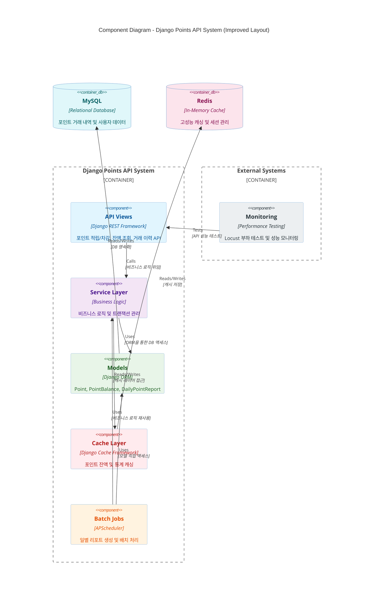

# tpjt-django-points-api

## Table of Contents

- [프로젝트 개요](#프로젝트-개요)
- [주요 기능](#주요-기능)
- [기술적 특징](#기술적-특징)
    - [동시성 제어](#동시성-제어)
    - [캐싱 시스템](#캐싱-시스템)
    - [배치 처리](#배치-처리)
    - [성능 테스트](#성능-테스트)
- [기술 스택](#기술-스택)
- [프로젝트 구조](#프로젝트-구조)
- [Diagram](#diagram)
    - [Component Diagram](#component-diagram)
    - [Class Diagram](#class-diagram)

# 프로젝트 개요

Django 기반의 사용자 포인트 적립/차감 관리 API 서비스입니다.

## 주요 기능

- **포인트 적립/차감 처리**: 사용자별 포인트 증감 트랜잭션 관리
- **포인트 잔액 관리**: 실시간 포인트 잔액 조회 및 업데이트
- **거래 이력 관리**: 모든 포인트 거래 내역 추적 및 저장
- **일별 리포트 생성**: 자동화된 일별 포인트 사용/적립 통계

## 기술적 특징

#### 동시성 제어

- **Optimistic Locking**: Django ORM 기반 동시 접근 제어
- **재시도 메커니즘**: backoff 라이브러리를 통한 트랜잭션 안정성 보장

#### 캐싱 시스템

- **Redis 기반 캐싱**: 고성능 데이터 조회를 위한 인메모리 캐싱
- **RPS 최적화**: 초당 요청 처리량 향상

#### 배치 처리

- **APScheduler 통합**: Django와 연동된 스케줄링 시스템
- **자동 리포트**: 일별 포인트 통계 자동 생성

#### 성능 테스트

- **Locust 부하 테스트**: API 성능 검증 및 병목 지점 분석
- **동시성 테스트**: 멀티 유저 환경에서의 안정성 검증

### 기술 스택

- **Backend**: Python 3.11, Django 5.2.2, Django REST Framework 3.16.0
- **Database**: MySQL 8.0
- **Cache**: Redis
- **Testing**: pytest-django, Locust
- **Scheduling**: APScheduler

### 프로젝트 구조

- **src-layout 구조**: 체계적인 Django 프로젝트 아키텍처
- **테스트 환경**: pytest 기반 포괄적 테스트 suite
- **API 설계**: APIView + LimitOffsetPagination 기반 RESTful API

# Diagram

## Component Diagram

시스템의 전체 아키텍처와 각 컴포넌트 간의 관계를 나타낸 컴포넌트 다이어그램입니다.

**API Views Layer**

- Django REST Framework 기반의 RESTful API 엔드포인트
- 포인트 적립/차감, 잔액 조회, 거래 이력 조회 기능 제공
- LimitOffsetPagination을 통한 대용량 데이터 페이징 처리

**Service Layer**

- 포인트 처리의 핵심 비즈니스 로직 구현
- Optimistic Locking을 통한 동시성 제어
- backoff 라이브러리를 활용한 재시도 메커니즘
- 트랜잭션 안정성 보장

**Models Layer**

- Django ORM 기반의 데이터 모델
- Point, PointBalance, DailyPointReport 등 핵심 엔티티
- 데이터 무결성 및 관계 관리

**Batch Jobs**

- APScheduler를 활용한 스케줄링 시스템
- 일별 포인트 통계 자동 생성
- 시스템 유지보수 작업 자동화

**Cache Layer**

- Redis 기반 고성능 인메모리 캐싱
- 포인트 잔액 조회 성능 최적화
- RPS(Request Per Second) 향상

**External Systems**

- Locust를 통한 성능 테스트 및 모니터링
- 동시성 테스트 및 병목 지점 분석

## Class Diagram

- 포인트 시스템의 핵심 모델들 간의 관계를 나타낸 클래스 다이어그램입니다.

### 모델 설명

**TimestampedModel (Abstract)**

- 모든 모델의 기본 클래스로 생성/수정 시간을 자동 관리
    - Django의 Abstract Model을 활용한 공통 필드 정의

**Point**

- 모든 포인트 거래 내역을 저장하는 핵심 모델
    - EARN(적립), USED(사용), CANCELED(취소) 세 가지 타입 지원
    - balance_snapshot을 통해 거래 시점의 잔액 스냅샷 보관
    - PointBalance와 외래키 관계로 연결

**PointBalance**

- 사용자별 현재 포인트 잔액을 관리
    - Optimistic Locking 패턴을 구현하여 동시성 제어
    - version 필드를 통한 낙관적 잠금 메커니즘
    - 잔액 증감을 위한 다양한 메소드 제공

**DailyPointReport**

- 일별 포인트 사용/적립 통계를 저장
    - 배치 처리를 통해 자동으로 생성되는 리포트
    - net_amount(순 포인트) 계산을 통한 일일 포인트 변동량 추적

**PointSummary**

- 메모리상에서 사용되는 데이터 클래스
    - 포인트 요약 정보를 임시로 담기 위한 객체
    - 데이터베이스에 저장되지 않는 순수 데이터 홀더
